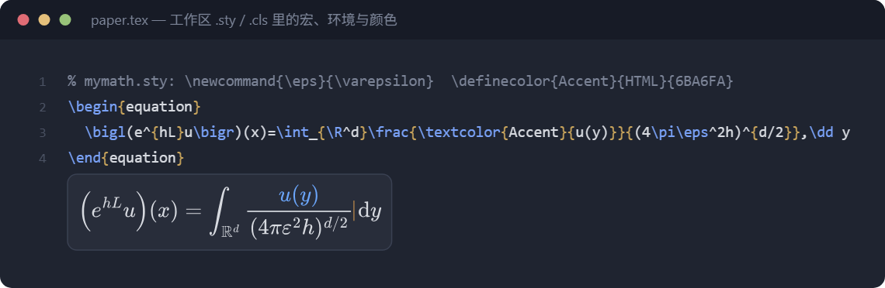
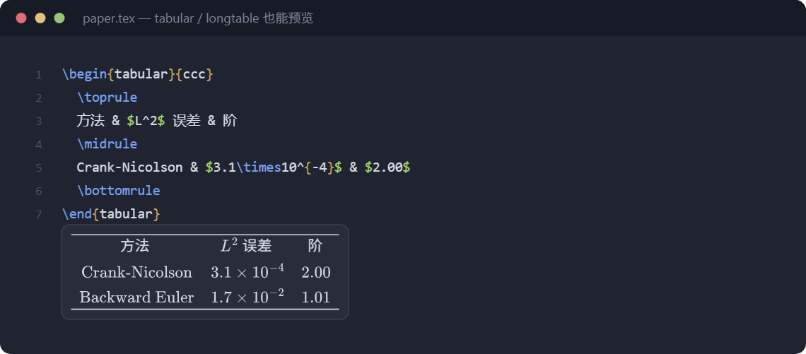
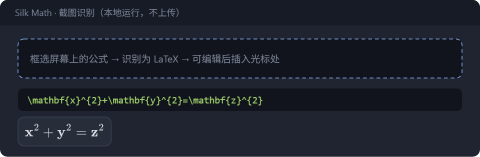

  <strong>光标走到哪，公式就在哪渲染。</strong> 
  <strong>Live math preview that follows your caret.</strong>

LaTeX · Markdown · Jupyter · Windows / macOS / Linux

  

## 中文

打开 `.tex`、Markdown 或 Jupyter，把光标放进公式里。预览会出现在旁边，橙色细线标出你正在写的位置——不用编译，边写边看。

你自己定义的宏、环境、颜色和表格都会一起显示。写错的命令标成红色，其余部分照常渲染。

- **开关预览** `Ctrl+Alt+M`（Mac：`Cmd+Alt+M`），关掉当前浮层 `Esc`
- **控制面板** 点状态栏的 **Silk Math**：调大小、暂停、排除当前文件
- **截图识别** 点状态栏的相机图标

  

  

  

## English

Open a `.tex`, Markdown, or Jupyter file and put the caret inside a formula. A preview appears beside it; an orange hairline marks where you are typing. No compile step.

Your own macros, environments, colors, and tables show up too. Undefined commands appear in red; the rest of the formula still renders.

- **Toggle** with `Ctrl+Alt+M` (`Cmd+Alt+M` on Mac); dismiss with `Esc`
- **Control panel**: click **Silk Math** in the status bar to resize, snooze, or exclude the current file
- **Screenshot OCR**: click the camera icon

MIT License · [LICENSE](LICENSE) · [Third-party notices](THIRD_PARTY_NOTICES.md)
